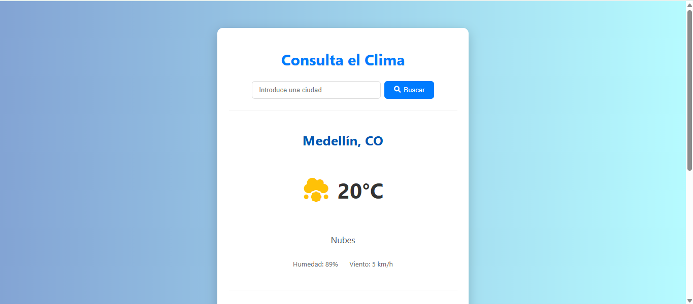
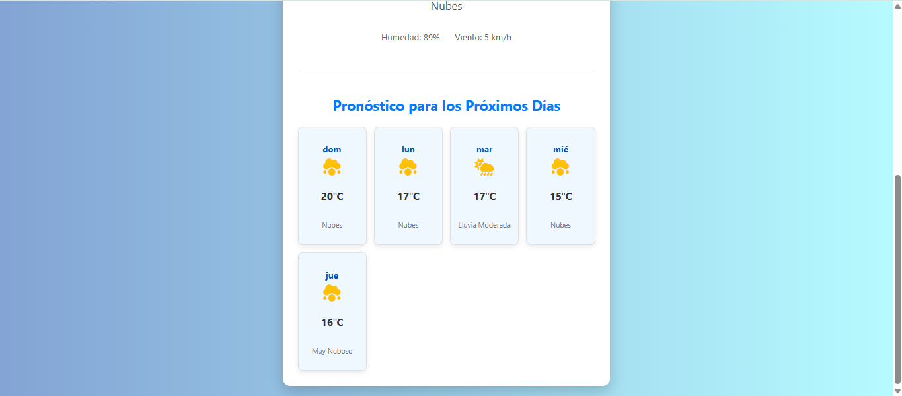

# Mi-propia-app-del-clima
Aplicación web para consultar el clima. Está diseñada para ser una herramienta sencilla donde puedes buscar el clima actual y un pronóstico para los próximos días de cualquier ciudad que escribas. Desarrollada en HTML5, CSS3 Y JAVASCRIPT.

Capturas de la visualizacion de la interfaz.

---

Tecnolgias utilizadas
- HTML 5
- CSS3
- JAVASCRIPT
